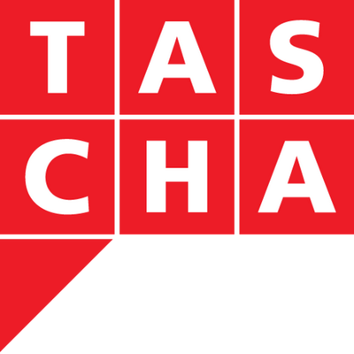
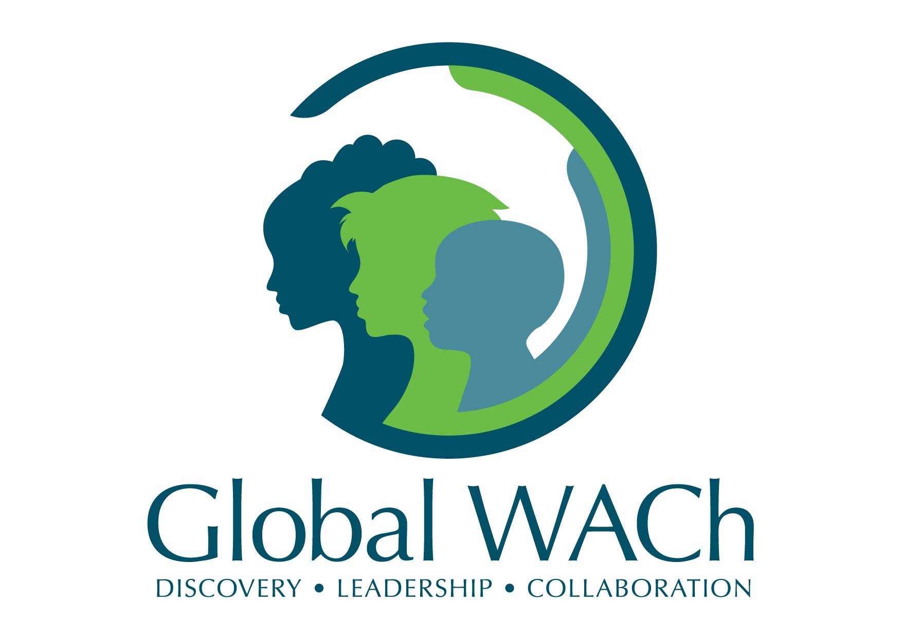
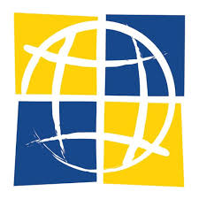

Change is a cross-campus collaboration bringing together faculty and
students from the University of Washington with the wider community to
collaborate on and explore the challenges of developing technology in
the context of positive social change. The change organization seeks
to make connections between researchers, outside organizations, and
the public to inspire the development of new capabilities aligned with
the interests of those most in need.

<h2>Participating Organizations</h2>

<table border="0" cellpadding="5">
<tr>

<td align="center" valign="center" width="25%">

</td>
<td align="center" valign="center" width="25%">

</td>
<td align="center" valign="center" width="25%">

</td>
<td align="center" valign="center" width="25%">

 
</td>

</tr>
<tr>
<td align="left" valign="top" width="25%">
The <a href="http://tascha.uw.edu/">Technology &amp; Social Change Group
(TASCHA)</a> at the University of Washington Information School
explores the design, use, and effects of information and communication
technologies in communities facing social and economic
challenges.
</td>
<td align="left" valign="top" width="25%">
The mission of <a href="http://depts.washington.edu/gwach/">Global WACh</a>
is to make scientific discoveries, cultivate leaders, and
bridge disciplines to advance the tightly connected health and
well-being of women, adolescents, and children.
</td>
<td align="left" valign="top" width="25%">
The <a href="https://www.go2itech.org/">International Training and
Education Center for Health (I-TECH)</a> is a global network that
works with local partners to develop skilled health care workers and
strong national health systems in resource-limited countries. I-TECH
promotes local ownership to sustain effective health systems.
</td>
<td align="left" valign="top" width="25%">
The <a href="http://ictd.cs.washington.edu/">Information and
Communication Technology for Development (ICTD) Lab</a> in the Paul G. 
Allen School of Computer Science is an
inter-disciplinary group that explores how ICTs and Computer Science can improve the
lives of underserved populations in low-income regions.
</td>
</tr>
</table>

<h2>Event Calendar</h2>

<iframe src="https://calendar.google.com/calendar/embed?showTitle=0&amp;showNav=0&amp;showPrint=0&amp;mode=AGENDA&amp;height=600&amp;wkst=1&amp;bgcolor=%23FFFFFF&amp;src=uwchange%40gmail.com&amp;color=%2323164E&amp;ctz=America%2FLos_Angeles" style="border-width:0" width="100%" height="100%" frameborder="0" scrolling="no"></iframe>

<a href="https://calendar.google.com/calendar?cid=dXdjaGFuZ2VAZ21haWwuY29t">View in Google Calendar</a>

<h2>Mailing List Archive</h2>

View on <a href="https://www.mail-archive.com/change@change.washington.edu/">mail-archive.com</a>

<!--
<h2>Logo Download</h2>

Download here for promoting or crediting change.
-->

